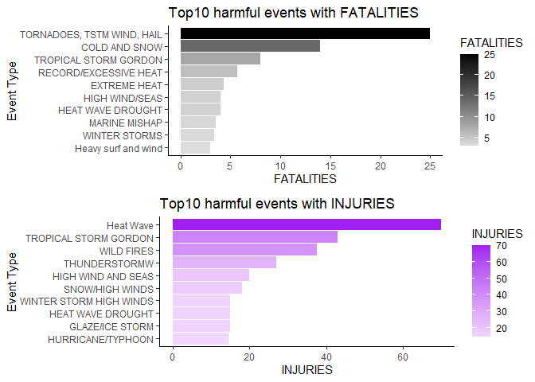

download files and read it

```r
Sys.setlocale(category = "LC_TIME", "C")
```

```
## [1] "C"
```

```r
Sys.setenv("LANGUAGE"="e")
path <- getwd()
url <- "https://d396qusza40orc.cloudfront.net/repdata%2Fdata%2FStormData.csv.bz2"
download.file(url, file.path(path, "NOAA_data.csv.bz2"))
NOAA_data <- read.csv("NOAA_data.csv.bz2")
names(NOAA_data)
```

```
##  [1] "STATE__"    "BGN_DATE"   "BGN_TIME"   "TIME_ZONE"  "COUNTY"    
##  [6] "COUNTYNAME" "STATE"      "EVTYPE"     "BGN_RANGE"  "BGN_AZI"   
## [11] "BGN_LOCATI" "END_DATE"   "END_TIME"   "COUNTY_END" "COUNTYENDN"
## [16] "END_RANGE"  "END_AZI"    "END_LOCATI" "LENGTH"     "WIDTH"     
## [21] "F"          "MAG"        "FATALITIES" "INJURIES"   "PROPDMG"   
## [26] "PROPDMGEXP" "CROPDMG"    "CROPDMGEXP" "WFO"        "STATEOFFIC"
## [31] "ZONENAMES"  "LATITUDE"   "LONGITUDE"  "LATITUDE_E" "LONGITUDE_"
## [36] "REMARKS"    "REFNUM"
```
## Data Processing
Across the US, which types of events are most harmful with respect to population health?
calculate mean value for each event type by aggregate function

```r
fatalities_byevent <- aggregate(FATALITIES ~ EVTYPE, data = NOAA_data, mean, na.rm = TRUE)
injuries_byevent <- aggregate(INJURIES ~ EVTYPE, data = NOAA_data, mean, na.rm = TRUE)
```

Across the US, which types of events have the greatest economic consequences?
convert unit k and m into actual numbers

```r
# mutate new column reflecting units thousand K and million M
NOAA_data <- mutate(NOAA_data, PROPDMGNM = PROPDMG)
NOAA_data <- mutate(NOAA_data, CROPDMGNM = CROPDMG)
for (i in 1:length(NOAA_data)){
  if (NOAA_data$PROPDMGEXP[i] == "K"){
    NOAA_data$PROPDMGNM[i] <- NOAA_data$PROPDMG[i] * 1000
    if (NOAA_data$PROPDMGEXP[i] == "M"){
      NOAA_data$PROPDMGNM[i] <- NOAA_data$PROPDMG[i] * 1000000
    }
  }
 if (NOAA_data$CROPDMGEXP[i] == "K"){
    NOAA_data$CROPDMGNM[i] <- NOAA_data$CROPDMG[i] * 1000
    if (NOAA_data$CROPDMGEXP[i] == "M"){
      NOAA_data$CROPDMGNM[i] <- NOAA_data$CROPDMG[i] * 1000000
    }
 }
}
```

calculate mean value for each event type by aggregate function

```r
propdmg_byevent <- aggregate(PROPDMGNM ~ EVTYPE, data = NOAA_data, mean, na.rm = TRUE)
cropdmg_byevent <- aggregate(CROPDMGNM ~ EVTYPE, data = NOAA_data, mean, na.rm = TRUE)
```


## Results
Across the US, which types of events are most harmful with respect to population health?

```r
max(fatalities_byevent$FATALITIES)
```

```
## [1] 25
```

```r
max(injuries_byevent$INJURIES)
```

```
## [1] 70
```

```r
fatalities_byevent$EVTYPE[which.max(fatalities_byevent$FATALITIES)]
```

```
## [1] "TORNADOES, TSTM WIND, HAIL"
```

```r
injuries_byevent$EVTYPE[which.max(injuries_byevent$INJURIES)]
```

```
## [1] "Heat Wave"
```

find which types of event have the greatest economic consequences

```r
propdmg_byevent$EVTYPE[which.max(propdmg_byevent$PROPDMGNM)]
```

```
## [1] "COASTAL EROSION"
```

```r
cropdmg_byevent$EVTYPE[which.max(cropdmg_byevent$CROPDMGNM)]
```

```
## [1] "DUST STORM/HIGH WINDS"
```

#What are top 10 harmful event with respect to health and economics

```r
fatalities_byevent_desc <- arrange(fatalities_byevent, desc(FATALITIES))
injuries_byevent_desc <- arrange(injuries_byevent, desc(INJURIES))
propdmg_byevent_desc <- arrange(propdmg_byevent, desc(PROPDMGNM))
cropdmg_byevent_desc <- arrange(cropdmg_byevent, desc(CROPDMGNM))
```

#Top10 events caused highest property damage

```r
top10_events_prop <- head(propdmg_byevent_desc, 10)

ggplot(top10_events_prop, aes(reorder(EVTYPE,PROPDMGNM),PROPDMGNM))+ geom_col(aes(fill = PROPDMGNM)) + scale_fill_gradient2(low = "white", high = "blue") + coord_flip() + theme_classic() + labs(y = "Property damage", x = "Event Type") + ggtitle("Top10 events caused highest PROPERTY damage")
```

<!-- -->

#Top10 events caused highest crop damage


```r
top10_events_crops <- head(arrange(cropdmg_byevent,desc(CROPDMGNM)), 10)
ggplot(top10_events_crops, aes(reorder(EVTYPE,CROPDMGNM),CROPDMGNM))+ geom_col(aes(fill = CROPDMGNM)) + scale_fill_gradient2(low = "white", high = "red") + coord_flip() + theme_classic() + labs(y = "Crop damage", x = "Event Type") + ggtitle("Top10 events caused highest CROP damage")
```

<!-- -->

#Top10 harmful events with fatalities


```r
top10_events_fatalities <- head(arrange(fatalities_byevent, desc(FATALITIES)), 10)
ggplot(top10_events_fatalities, aes(reorder(EVTYPE,FATALITIES),FATALITIES))+ geom_col(aes(fill = FATALITIES)) + scale_fill_gradient2(low = "white", high = "black") + coord_flip() + theme_classic() + labs(y = "FATALITIES", x = "Event Type") + ggtitle("Top10 harmful events with FATALITIES")
```

<!-- -->
#Top10 harmful events with INJURIES


```r
top10_events_injuries <- head(arrange(injuries_byevent, desc(INJURIES)), 10)
ggplot(top10_events_injuries, aes(reorder(EVTYPE,INJURIES),INJURIES))+ geom_col(aes(fill = INJURIES)) + scale_fill_gradient2(low = "white", high = "purple") + coord_flip() + theme_classic() + labs(y = "INJURIES", x = "Event Type") + ggtitle("Top10 harmful events with INJURIES")
```

<!-- -->
